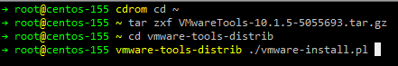

# VMware安装VMware-Tools

### 0. 安装kernel

```
yum install kernel-devel

cd /lib/modules/$(uname -r)/build/include/linux
sudo ln -s ../generated/utsrelease.h
sudo ln -s ../generated/autoconf.h
sudo ln -s ../generated/uapi/linux/version.h 
```

#### kernel header path

```
/usr/src/kernels/$(uname -r)/include

# $(uname -r)换成具体值
```

### 1. 下载VMware-Tools

`VMware Workstation -> 虚拟机 -> 安装VMware-Tools`


### 2. 挂载cdrom

```
mkdir -p /mnt/cdrom

mount /dev/cdrom /mnt/cdrom
```

### 3. 安装VMware-Tools

```
# vmware-tools复制到用户目录
cd /mnt/cdrom
cp VMwareTools-10.1.5-5055693.tar.gz ~

# 解压
cd ~
tar zxvf VMwareTools-10.1.5-5055693.tar.gz

# 进入目录并执行安装
cd vmware-tools-distrib
./vmware-install.pl
```



注：

在安装过程中提示

```
The path "" is not a valid path to the 3.10.0-862.3.2.el7.x86_64 kernel headers.
Would you like to change it? [yes]
Enter the path to the kernel header files for the 3.10.0-862.3.2.el7.x86_64 kernel? 
```

输入在上面安装的kernel header path即可


```
/usr/src/kernels/$(uname -r)/include

# $(uname -r)换成具体值

本地kernel 3.10.0-862.3.2.el7.x86_64
```

### 4. 在vmware设置共享目录


### 5. 安装open-vm-tools

```
yum install open-vm-tools
```

### 6. 设置

```
mkdir -p /mnt/hgfs/project

vmhgfs-fuse .host:/project /mnt/hgfs/project
```
